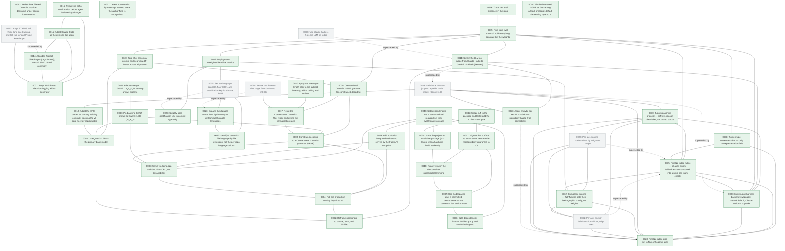

# Decision Tree

_Generated by `scripts/build_decision_log.py`. Do not edit by hand._

```mermaid
graph TD
  n0001["0001: Adopt ADR-based decision logging with a generator"]:::accepted
  n0002["0002: Reframe positioning to private, local, and distilled"]:::accepted
  n0003["0003: Use Qwen3-1.7B as the primary base model"]:::accepted
  n0004["0004: Pull the production serving layer into v1"]:::accepted
  n0005["0005: Serve via llama.cpp and GGUF on CPU, not bitsandbytes"]:::accepted
  n0006["0006: Split dependencies into a CPU/dev group and a GPU/train group"]:::accepted
  n0007["0007: Use Codespaces plus a committed devcontainer as the canonical dev environment"]:::accepted
  n0008["0008: Use claude-haiku-4-5 as the LLM-as-judge"]:::superseded
  n0009["0009: Constrain decoding to a Conventional Commits grammar (GBNF)"]:::accepted
  n0010["0010: Run uv sync in the devcontainer postCreateCommand"]:::accepted
  n0011["0011: Switch the LLM-as-judge from Claude Haiku to Gemini 2.5 Flash (free tier)"]:::accepted
  n0012["0012: Redistribute filtered CommitChronicle derivative under source license terms"]:::accepted
  n0013["0013: Adopt STATUS.md, three-lane doc tracking, and GitHub-synced Project knowledge"]:::superseded
  n0014["0014: Abandon Project GitHub sync (org-blocked); manual STATUS.md continuity"]:::accepted
  n0015["0015: Adopt Claude Code as the decision-log agent"]:::accepted
  n0016["0016: Require id-echo confirmation before agent decision-log changes"]:::accepted
  n0017["0017: Relax the Conventional Commits filter regex and define the normalization spec"]:::accepted
  n0018["0018: Revise the dataset-size target from 30-50k to ~20-30k"]:::superseded
  n0019["0019: Adopt the HPC cluster as primary training compute, keeping the v1 core free-tier reproducible"]:::accepted
  n0020["0020: Apply the message-length filter to the subject line only, with a ceiling and no floor"]:::accepted
  n0021["0021: Detect bot commits by message pattern, since the author field is anonymized"]:::accepted
  n0022["0022: Identify a commit's file language by file extension, not the per-repo language column"]:::accepted
  n0023["0023: Expand the dataset scope from Python-only to all CommitChronicle languages"]:::accepted
  n0024["0024: Make the project an installable package (src-layout with a hatchling build backend)"]:::accepted
  n0025["0025: Set per-language cap (6k), floor (500), and stratification key for dataset build"]:::superseded
  n0026["0026: Simplify split stratification key to commit type only"]:::accepted
  n0027["0027: Adopt analytic per-axis LLM rubric with plausibility-based type-correctness"]:::accepted
  n0028["0028: Finalize judge axis set to four orthogonal axes"]:::accepted
  n0029["0029: Per-axis scoring scales mixed by judgment shape"]:::superseded
  n0030["0030: Judge reasoning protocol — diff-first, reason-then-label, structured output"]:::accepted
  n0031["0031: Per-axis anchor definitions for all four judge axes"]:::superseded
  n0032["0032: Composite scoring — faithfulness gate then lexicographic priority, no weights"]:::accepted
  n0033["0033: Switch the LLM-as-judge to a paid Claude model (Sonnet 4.6)"]:::superseded
  n0034["0034: Make judge harness backend-swappable; Gemini default, Claude optional upgrade"]:::accepted
  n0035["0035: Finalize judge rubric — all axes binary, faithfulness decomposed into atomic per-claim checks"]:::accepted
  n0036["0036: Tighten type-correctness bar — only misrepresentation fails"]:::accepted
  n0037["0037: Deployment-reweighted headline metrics"]:::accepted
  n0038["0038: Pin baseline GGUF artifact to Qwen3-1.7B Q4_K_M"]:::accepted
  n0039["0039: Conventional Commits GBNF grammar for constrained decoding"]:::accepted
  n0040["0040: Zero-shot canonical prompt and near-raw diff format across all phases"]:::accepted
  n0041["0041: Migrate dev surface to local-native; relocate the reproducibility guarantee to CI"]:::accepted
  n0042["0042: Scope ruff to the package and tests; add the CI lint + test gate"]:::accepted
  n0043["0043: Add portfolio-integrated web demo served by the FastAPI endpoint"]:::accepted
  n0044["0044: Adapter-merge → GGUF → Q4_K_M serving-artifact pipeline"]:::accepted
  n0045["0045: Fine-tune eval protocol: hold everything constant but the weights"]:::accepted
  n0046["0046: Track raw eval evidence in the repo"]:::accepted
  n0047["0047: Split dependencies into a serve-minimal required set with eval/train/dev groups"]:::accepted
  n0048["0048: Pin the fine-tuned GGUF as the serving artifact of record; default the serving layer to it"]:::accepted
  n0003 --- n0002
  n0004 --- n0002
  n0005 --- n0004
  n0007 --- n0006
  n0009 --- n0004
  n0009 --- n0005
  n0010 --- n0007
  n0008 -. superseded by .-> n0011
  n0011 --- n0002
  n0013 --- n0001
  n0013 -. superseded by .-> n0014
  n0014 --- n0001
  n0015 --- n0001
  n0015 --- n0014
  n0016 --- n0001
  n0016 --- n0015
  n0017 --- n0009
  n0018 --- n0017
  n0019 --- n0003
  n0020 --- n0017
  n0018 -. superseded by .-> n0023
  n0023 --- n0022
  n0024 --- n0010
  n0025 --- n0023
  n0025 --- n0022
  n0025 -. superseded by .-> n0026
  n0027 --- n0011
  n0027 -. superseded by .-> n0028
  n0029 --- n0028
  n0030 --- n0028
  n0030 --- n0029
  n0031 --- n0028
  n0031 --- n0029
  n0031 --- n0030
  n0032 --- n0028
  n0032 --- n0029
  n0032 --- n0031
  n0011 -. superseded by .-> n0033
  n0033 --- n0019
  n0033 --- n0027
  n0033 --- n0028
  n0033 --- n0030
  n0033 -. superseded by .-> n0034
  n0034 --- n0011
  n0034 --- n0028
  n0034 --- n0030
  n0029 -. superseded by .-> n0035
  n0031 -. superseded by .-> n0035
  n0035 --- n0028
  n0035 --- n0030
  n0035 --- n0032
  n0035 --- n0034
  n0036 --- n0028
  n0036 --- n0035
  n0037 --- n0025
  n0037 --- n0026
  n0037 --- n0032
  n0038 --- n0003
  n0038 --- n0005
  n0038 --- n0009
  n0039 --- n0009
  n0039 --- n0017
  n0040 --- n0003
  n0040 --- n0039
  n0041 --- n0007
  n0041 --- n0010
  n0042 --- n0024
  n0042 --- n0041
  n0043 --- n0004
  n0043 --- n0005
  n0044 --- n0038
  n0045 --- n0034
  n0045 --- n0011
  n0045 --- n0035
  n0045 --- n0036
  n0045 --- n0039
  n0045 --- n0040
  n0045 --- n0037
  n0046 --- n0045
  n0047 --- n0005
  n0047 --- n0006
  n0047 --- n0024
  n0047 --- n0043
  classDef proposed fill:#fff7e6,stroke:#d4a017;
  classDef accepted fill:#e6f4ea,stroke:#137333;
  classDef superseded fill:#f1f3f4,stroke:#9aa0a6,color:#5f6368;
  classDef deprecated fill:#fce8e6,stroke:#c5221f,color:#5f6368;
```
